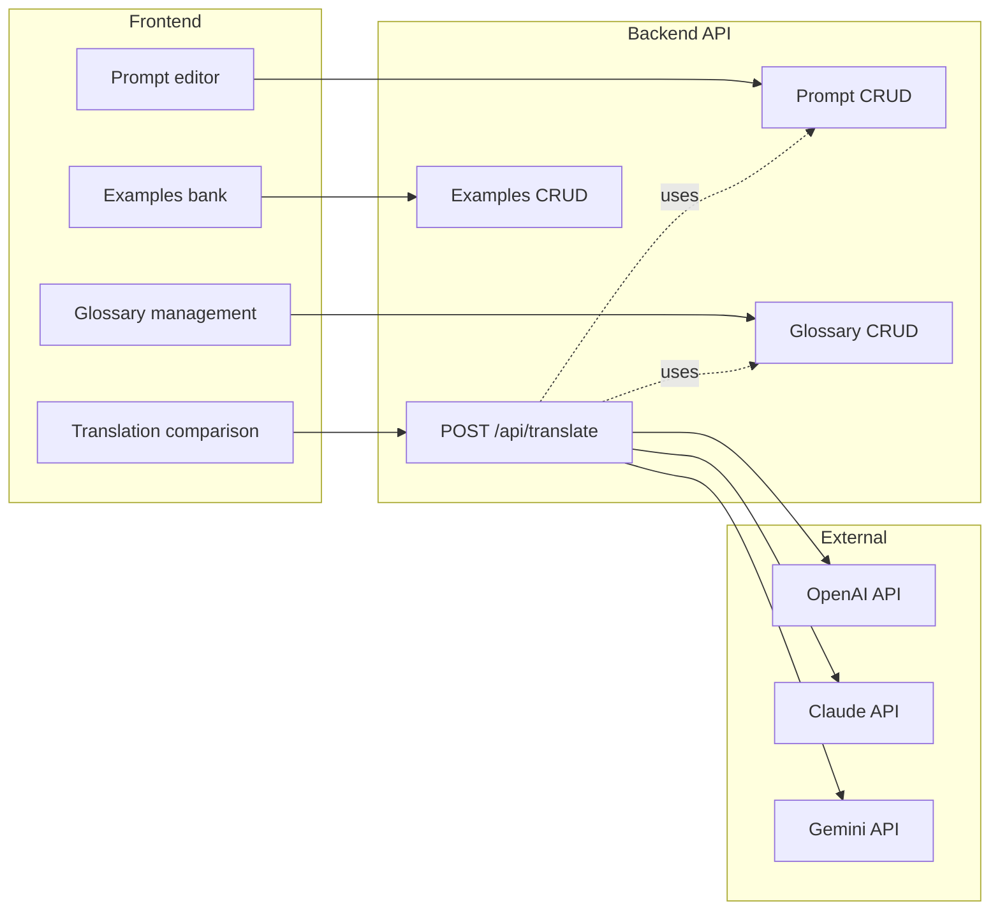

# Translation Comparison & Prompt Management Website

## Goal

A standalone "translation lab" website where you can:

- **Compare** translations from OpenAI, Claude, and Gemini for the same input phrase.
- **Manage** a shared system prompt and glossary (including insurance companies like מגדל and מנורה).
- **Refine** the prompt/glossary using an examples bank (source phrase, correct translation, and "why" explanation).
- **Decide** which provider to use in production and **export** the final prompt + glossary for your customer support application.

The real customer support app stays unchanged; this site is only for building and evaluating the translation setup.

---

## Design decisions (locked in)

| Decision                | Choice                                                                                                |
| ----------------------- | ----------------------------------------------------------------------------------------------------- |
| **Framework**           | Next.js (React + API routes, one repo)                                                                |
| **Storage**             | JSON data model; **Vercel Blob** for persistence (works on serverless; no local filesystem on Vercel) |
| **Prompt versioning**   | Yes – save named/timestamped snapshots                                                                |
| **Examples → few-shot** | Manual – you refine the prompt using examples; no auto-inject                                         |
| **Target language**     | Configurable (e.g. dropdown: English or other)                                                        |
| **Auth**                | None – single user, prep for real development                                                         |
| **Deploy**              | Vercel                                                                                                |
| **Export**              | Both download (e.g. .txt + .json) and copy to clipboard                                               |
| **UI layout**           | Sidebar (Compare, Prompt, Glossary, Examples, Export)                                                |

---

## High-level architecture

- **Frontend**: Single app with sidebar sections for "Compare", "Prompt", "Glossary", "Examples", "Export".
- **Backend**: All LLM calls go through your server (API keys stay in env). Same prompt + glossary are injected for each provider when you run a comparison.
- **Data**: JSON stored in **Vercel Blob** (same structure as JSON files; backend reads/writes via `@vercel/blob`) so prompt, glossary, examples, and prompt versions persist across serverless invocations.

---

## Core features

### 1. Translation comparison

- **Input**: One text area for the phrase to translate (e.g. Hebrew or any language your agents receive).
- **Output**: One panel per provider (OpenAI, Claude, Gemini) showing translated text. **Target language** is configurable (dropdown, e.g. English / Spanish) and passed into the prompt and API.
  - Optional: latency and token/cost hint if easily available.
- **Behavior**: On "Translate", backend calls all three APIs in parallel with the **same** system prompt and glossary (see below). No API keys in the browser.

### 2. Prompt management

- **Stored**: One "current" system prompt (e.g. markdown text) that you edit in the UI.
- **Content**: The prompt should:
  - State the task: translate customer support messages into clear English for agents.
  - State the domain: travel health, finding doctors, bookings, insurance (B2B2C and B2C).
  - Instruct the model to preserve proper nouns and use the provided glossary.
  - Optionally reference "examples" (see below) as few-shot or as a quality guide.
- **Glossary injection**: Backend appends (or injects) the current glossary into the prompt so the model sees terms like "מגדל → Migdal (insurance company)", "מנורה → Menora Mivtachim (insurance company)" and does not translate them literally.
- **Versioning**: Save snapshots (timestamp or name) so you can revert or compare old vs new prompt.

### 3. Glossary management

- **Purpose**: Ensure insurance names and domain terms are not mistranslated (e.g. מגדל = tower, מנורה = lamp in generic Hebrew, but in your context they are insurer names).
- **Structure**: List of entries, e.g.:
  - **Term** (source language): e.g. מגדל, מנורה, or English terms you want standardized.
  - **Definition / translation**: e.g. "Migdal Insurance", "Menora Mivtachim Insurance".
  - **Note (optional)**: e.g. "Israeli insurer – do not translate as 'tower'."
- **UI**: Table or list with add/edit/delete; optional bulk import (CSV/JSON).
- **Use**: Backend builds a glossary block from this list and injects it into the system prompt for every translation request.

### 4. Examples bank

- **Purpose**: You provide "correct" examples and explanations; these drive prompt design.
- **Per example**:
  - **Source phrase** (original language).
  - **Correct translation** (your preferred English).
  - **Explanation**: Why this translation is correct (e.g. "מגדל here refers to the insurer; not 'tower'").
- **Use**: You use the list to refine the prompt text manually (no auto few-shot in v1).
- **UI**: List of examples with add/edit/delete.

---

## Data model (minimal)

- **Prompt**: `{ id, content, updatedAt }`. Plus **versions**: list of `{ id, name?, content, createdAt }` snapshots.
- **Glossary**: List of `{ term, translationOrDefinition, note? }`.
- **Examples**: List of `{ id, sourcePhrase, correctTranslation, explanation }`.

**Storage: Vercel Blob**  
Same JSON structures; stored as blobs (e.g. `prompt.json`, `prompt-versions.json`, `glossary.json`, `examples.json`) in Vercel Blob so the app works on serverless. Use `@vercel/blob` in API routes. For local dev, either use Vercel Blob with a dev token or a thin abstraction that falls back to local JSON files under `data/` when not on Vercel.

---

## Recommended tech stack

| Layer        | Suggestion                                         | Rationale                                             |
| ------------ | -------------------------------------------------- | ----------------------------------------------------- |
| **Frontend** | Next.js App Router                                 | One repo; API routes; good DX.                        |
| **Backend**  | Next.js API routes                                 | Keeps API keys on server; one deployment.             |
| **LLM SDKs** | OpenAI SDK, `@anthropic-ai/sdk`, `@google/generative-ai` | Official SDKs.                                        |
| **Storage**  | Vercel Blob (JSON blobs)                           | Persists on serverless; use `@vercel/blob`.           |
| **Env**      | `.env` for `OPENAI_API_KEY`, `ANTHROPIC_API_KEY`, `GEMINI_API_KEY` | Keys never sent to the client.                        |

---

## Prompt and glossary design (how you'll use the site)

1. **Initial prompt**: In the Prompt editor, write a system prompt that:
   - Defines the task: translate customer support messages into clear English (or chosen language) for agents.
   - Mentions travel health, doctors, bookings, insurance (B2B2C and B2C).
   - Says: "Use the following glossary for proper nouns and domain terms; do not translate glossary terms literally."
   - Leaves a clear placeholder like `{{GLOSSARY}}` for the backend to replace with the glossary text.
2. **Glossary**: In the Glossary section, add at least:
   - All supported insurance companies (e.g. מגדל, מנורה, and any others in Hebrew/local language and in English).
   - Any other terms that are often mistranslated (product names, plan names, etc.).
3. **Examples**: For each typical mistake (e.g. "מגדל" translated as "tower"), add an example with the correct translation and explanation. Use these to refine the prompt text.
4. **Compare**: Paste real or sample phrases, run comparison, and pick the provider that consistently respects the glossary and examples. Export the final prompt + glossary for use in your customer support app.

---

## Export for production

- **Export** (sidebar): "Export for production".
- **Output**: Download and/or copy:
  - Final system prompt (with `{{GLOSSARY}}` or the actual glossary embedded).
  - Glossary as JSON or formatted list.
- Use the same prompt and glossary in your support app with the chosen provider.

---

## Implementation phases

**Phase 1 – Foundation**

- Next.js app with App Router; `.env` for the three API keys.
- Backend: `POST /api/translate` that accepts `{ text, targetLanguage? }`, loads current prompt + glossary, injects glossary into prompt, and calls OpenAI, Claude, and Gemini in parallel; returns `{ openai, claude, gemini }` (each with `text` and optional `error`).
- Frontend: Compare page with one input, target-language dropdown, and three result panels.

**Phase 2 – Prompt and glossary**

- Storage via **Vercel Blob**: prompt, prompt versions, glossary (JSON blobs). Optional abstraction for local JSON in dev.
- API: `GET/PUT /api/prompt`, prompt versions (e.g. `GET/POST/DELETE /api/prompt/versions`), `GET/POST/PUT/DELETE /api/glossary`.
- Frontend: Prompt page (textarea + save + version list with restore), Glossary page (list + add/edit/delete). `/api/translate` uses saved prompt and glossary.

**Phase 3 – Examples and refinement**

- Store examples in Vercel Blob; API for examples CRUD.
- Frontend: Examples page to add/edit/delete (source phrase, correct translation, explanation).

**Phase 4 – Polish and export**

- **Export**: Sidebar section – show final prompt + glossary; download as file(s) and copy to clipboard.
- **Target language**: Dropdown in Compare view and in translate API.
- **UI**: Sidebar layout for Compare, Prompt, Glossary, Examples, Export.
- Error handling and per-provider loading states.

---

## Security and deployment

- **API keys**: Only in server-side env; never in client or repository.
- **Deployment**: Vercel; API keys in Vercel env; data in Vercel Blob.
- **Access**: No auth in app; single user / internal use (use Vercel password or network if needed).

---

## Summary

You get a single website where you:

1. **Manage** one system prompt and a glossary (including insurers מגדל and מנורה and other terms).
2. **Add examples** with correct translations and explanations to refine the prompt.
3. **Compare** the same phrase across OpenAI, Claude, and Gemini with one click.
4. **Export** the winning prompt + glossary for use in your customer support application.

The plan is scoped so you can build and use the comparison and prompt/glossary management without changing the existing customer support app until you integrate the chosen provider and exported assets.
